目录  
<font size=4>[一、介绍](#1)</font>

<font size=4>[二、创建多人游戏插件](#2)</font>

<font size=4>[三、创建项目](#3)</font>

&emsp;[3.1 项目创建及准备工作](#3.1)  
&emsp;[3.2 资产 Assets](#3.2)  
&emsp;[3.3 动画及重定向 Retargeting Animations](#3.3)  
&emsp;[3.4 角色创建](#3.4)  
&emsp;[3.5 摄像机和弹簧臂 Camera and Spring Arm](#3.5)  
&emsp;[3.6 人物移动](#3.6)  
&emsp;[3.7 动画蓝图](#3.7)  
&emsp;[3.8 无缝传送 Seamless travel and lobby](#3.8)  
&emsp;[3.9 网络规则 Network Role](#3.9)  

<font size=4>[四、武器](#4)</font>

&emsp;[4.1 武器类](#4.1)  
&emsp;[4.2 捡子弹 Pickup Widget](#4.2)  
&emsp;[4.3 变量复制 Variable Replication](#4.3)  
&emsp;[4.4 装备武器 Equipping Weapons](#4.4)  
&emsp;[4.5 远程过程调用 Remote Procedure Calls](#4.5)  
&emsp;[4.6 装备动画姿势 Equipped Animation Pose](#4.6)  
&emsp;[4.7 蹲下 Crouching](#4.7)  
&emsp;[4.8 瞄准 Aiming](#4.8)  
&emsp;[4.9 跑步混合空间 Running Blendspace](#4.9)  
&emsp;[4.10 倾斜和扫射 Leaning and Strafing](#4.10)  
&emsp;[4.11 走路和跳跃 Idle and Jumps](#4.11)  
&emsp;[4.12 蹲走 Crouch Walking](#4.12)  
&emsp;[4.13 瞄准走 Aim Walking](#4.13)  
&emsp;[4.14 瞄准偏移 Aim Offsets](#4.14)  
&emsp;[4.15 瞄准偏移应用](#4.15)  
&emsp;[4.16 多人匹配 Pitch in Multiplayer](#4.16)  
&emsp;[4.17 使用瞄准偏移](#4.17)  
&emsp;[4.18 FABRIK IK](#4.18)  
&emsp;[4.19 原地转弯 Turning in place](#4.19)  
&emsp;[4.20 旋转根骨骼 Rotate Root Bone](#4.20)  
&emsp;[4.21 网络更新频率](#4.21)  
&emsp;[4.22 未装备时蹲着](#4.22)  
&emsp;[4.23 跑步转弯动画 Rotating Running Animations](#4.23)  
&emsp;[4.24 脚步声和跳跃声 Footstep and Jump Sounds](#4.24)  
&emsp;[4.25 瞄准走](#4.25)  

<font size=4>[五、射击武器](#5)</font>

&emsp;[5.1 炮弹武器类 Projectile Weapon Class](#5.1)  
&emsp;[5.2 火蒙太奇 Fire Montage](#5.2)  
&emsp;[5.3 火武器效果](#5.3)  
&emsp;[5.4 多人游戏中的火效果 Fire Effects in Multiplayer](#5.4)  
&emsp;[5.5 击中目标 The Hit Target](#5.5)  
&emsp;[5.6 生成炮弹 Spawning the Projectile](#5.6)  
&emsp;[5.7 炮弹移动组件](#5.7)  
&emsp;[5.8 炮弹追踪 Projectile Tracer](#5.8)  
&emsp;[5.9 重复击中目标](#5.9)  
&emsp;[5.10 炮弹命中事件](#5.10)  
&emsp;[5.11 弹壳](#5.11)  
&emsp;[5.12 弹壳的物理性质](#5.12)  

<font size=4>[六、武器瞄准机制](#6)</font>

&emsp;[6.1 游戏HUD和玩家控制器 Blaster HUD and Player Controller](#6.1)  
&emsp;[6.2 绘制准星 Drawing the Crosshairs](#6.2)  
&emsp;[6.3 武器旋转矫正 Correcting the Weapon Rotation](#6.3)  
&emsp;[6.4 瞄准缩放 Zoom While Aiming](#6.4)  
&emsp;[6.5 准星缩放 Shrink Crosshairs when Aiming](#6.5)  
&emsp;[6.6 改变准星颜色](#6.6)  
&emsp;[6.7 扩展跟踪开始 Extending the Trace Start](#6.7)  
&emsp;[6.8 命中角色](#6.8)  
&emsp;[6.9 平滑代理角色的旋转 Smooth Rotation for Proxies](#6.9)  
&emsp;[6.10 自动开火 Automatic Fire](#6.10)  
&emsp;[6.11 测试](#6.11)  

<font size=4>[七、健康状况和玩家统计数据](#7)</font>

&emsp;[7.1 游戏框架 Game Framework](#7.1)  
&emsp;[7.2 血量 Health](#7.2)  
&emsp;[7.3 更新血量 Update Health in the HUD](#7.3)  
&emsp;[7.4 伤害 Demage](#7.4)  
&emsp;[7.5 游戏模式 Blaster Game Mode](#7.5)  
&emsp;[7.6 消除动画 Elim Animation](#7.6)  
&emsp;[7.7 重生 Respawning](#7.7)  
&emsp;[7.8 物质溶解 Dissolve Material](#7.8)  
&emsp;[7.9 溶解角色](#7.9)  
&emsp;[7.10 溶解曲线 Dissolving with Curves](#7.10)  
&emsp;[7.11 被消除时禁止移动 Disable Movement when Elimmed](#7.11)  
&emsp;[7.12 消除机器人](#7.12)  
&emsp;[7.13 拥有状态 On Possess](#7.13)  
&emsp;[7.14 角色状态 Blaster Player State](#7.14)  
&emsp;[7.15 战败 Defeats](#7.15)  

<font size=4>[八、弹药](#8)</font>

&emsp;[8.1 武器弹药](#8.1)  
&emsp;[8.2 可以开火](#8.2)  
&emsp;[8.3 携带子弹](#8.3)  
&emsp;[8.4 显示携带子弹](#8.4)  
&emsp;[8.5 换子弹 Reloading](#8.5)  
&emsp;[8.6 重载战斗状态](#8.6)  
&emsp;[8.7 允许武器开火](#8.7)  
&emsp;[8.8 更新子弹](#8.8)  
&emsp;[8.9 换弹效果 Reload Effects](#8.9)  
&emsp;[8.10 自动装填](#8.10)

<font size=4>[九、匹配状态](#9)</font>

&emsp;[9.1 游戏时间](#9.1)  
&emsp;[9.2 同步客户端和服务器时间 Syncing Client and Server Time](#9.2)  
&emsp;[9.3 匹配状态](#9.3)  
&emsp;[9.4 正在匹配状态设置](#9.4)  
&emsp;[9.5 预热时间 Warmup Timer](#9.5)  
&emsp;[9.6 预热时间更新](#9.6)  
&emsp;[9.7 自定义匹配状态 Custom Match States](#9.7)  
&emsp;[9.8 冷却时间公告 Cooldown Announcement](#9.8)  
&emsp;[9.9 重启游戏](#9.9)  
&emsp;[9.10 游戏状态 Blaster Game State](#9.10)

<font size=4>[十、不同武器类型](#10)</font>

&emsp;[10.1 火箭弹 Rocket Projectile](#10.1)  
&emsp;[10.2 火箭轨迹 Rocket Trails](#10.2)  
&emsp;[10.3 生成火箭轨迹 Rocket Trails](#10.3)  
&emsp;[10.4 火箭移动组件](#10.4)  
&emsp;[10.5 命中扫描武器 Hit Scan Weapons](#10.5)  
&emsp;[10.6 激光 Beam Particles](#10.6)  
&emsp;[10.7 冲锋枪 Submachine Gun](#10.7)  
&emsp;[10.8 Strap Physics](#10.8)  
&emsp;[10.9 霰弹枪 Shotgun](#10.9)  
&emsp;[10.10 武器散布 Weapon Scatter](#10.10)  
&emsp;[10.11 狙击步枪 Sniper Rifle](#10.11)  
&emsp;[10.12 狙击镜 Sniper Scope](#10.12)  
&emsp;[10.13 手榴弹发射器 Grenade Launcher](#10.13)  
&emsp;[10.14 榴弹 Projectile Grenades](#10.14)  
&emsp;[10.15 装填动画](#10.15)  
&emsp;[10.16 霰弹枪装填](#10.16)  
&emsp;[10.17 weapon outline effects](#10.17)  
&emsp;[10.18 扔手榴弹蒙太奇 Grenade Throw Montage](#10.18)  
&emsp;[10.19 扔手榴弹时的武器附着](#10.19)  
&emsp;[10.20 榴弹资产](#10.20)  
&emsp;[10.21 展示](#10.21)  
&emsp;[10.22 生成手榴弹](#10.22)  
&emsp;[10.23 多人游戏中的手榴弹](#10.23)  
&emsp;[10.24 HUD中的手榴弹](#10.24)

<font size=4>[十一、拾取](#11)</font>

&emsp;[11.1 拾取类](#11.1)  
&emsp;[11.2 拾取子弹](#11.2)  
&emsp;[11.3 buff组件](#11.3)  
&emsp;[11.4 血量拾取](#11.4)  
&emsp;[11.5 治疗角色](#11.5)  
&emsp;[11.6 速度buff](#11.6)  
&emsp;[11.7 跳跃buff](#11.7)  
&emsp;[11.8 护盾 Shield Bar](#11.8)  
&emsp;[11.9 护盾更新](#11.9)  
&emsp;[11.10 拾取出生点](#11.10)  
&emsp;[11.11 添加出生点](#11.11)  
&emsp;[11.12 出生时的默认武器](#11.12)  
&emsp;[11.13 副武器](#11.13)  
&emsp;[11.14 更换武器](#11.14)  
&emsp;[11.15 丢掉副武器](#11.15)  

<font size=4>[十二、滞后补偿](#12)</font>

&emsp;[12.1 滞后补偿概念 Lag Compensation Concepts](#12.1)  
&emsp;[12.2 高延迟警告](#12.2)  
&emsp;[12.3 本地开火效果 Local Fire Effects](#12.3)  
&emsp;[12.4 显示本地子弹 Show the Widget Locally](#12.4)  
&emsp;[12.5 重复散射 Replicating Scatter](#12.5)  
&emsp;[12.6 重复霰弹散射](#12.6)  
&emsp;[12.7 霰弹开火RPCs Shotgun Fire RPCs](#12.7)  
&emsp;[12.8 客户端预测 Client-Side Prediction](#12.8)  
&emsp;[12.9 客户端预测子弹](#12.9)  
&emsp;[12.10 客户端预测瞄准](#12.10)  
&emsp;[12.11 客户端预测装填](#12.11)  
&emsp;[12.12 服务端倒带 Server-Side Rewind](#12.12)  
&emsp;[12.13 滞后补偿组件](#12.13)  
&emsp;[12.14 命中盒 Hit Boxes](#12.14)  
&emsp;[12.15 帧包 Frame Package](#12.15)  
&emsp;[12.16 保存帧包](#12.16)  
&emsp;[12.17 帧历史](#12.17)  
&emsp;[12.18 时间倒带 Rewinding Time](#12.18)  
&emsp;[12.19 帧之间插值 Interp Between Frames](#12.19)  
&emsp;[12.20 确认命中 Confirming the hit](#12.20)  
&emsp;[12.21 得分请求 Score Request](#12.21)  
&emsp;[12.22 服务端为霰弹枪倒带](#12.22)  
&emsp;[12.23 确认霰弹枪命中](#12.23)  
&emsp;[12.24 霰弹枪得分请求](#12.24)  
&emsp;[12.25 请求霰弹枪命中](#12.25)  
&emsp;[12.26 预测弹丸轨迹 Predict projectile Path](#12.26)  
&emsp;[12.27 后期对改变的属性编辑 Post Edit Change Property](#12.27)  
&emsp;[12.28 本地生成弹丸轨迹 Spawning Projectile Locally](#12.28)  
&emsp;[12.29 包围盒爆炸类型 Hit Box Collision Type](#12.29)  
&emsp;[12.30 服务端弹丸倒带 Projectile Server-Side Rewind](#12.30)  
&emsp;[12.31 弹丸得分请求](#12.31)  
&emsp;[12.32 限制服务器倒带 Limiting Server-Side Rewind](#12.32)  
&emsp;[12.33 更换武器动画](#12.33)  
&emsp;[12.34 完善滞后补偿](#12.34)  
&emsp;[12.35 非法作弊](#12.35)  

<font size=4>[十三、更多多人游戏类型](#13)</font>

&emsp;[13.1 返回主菜单 Return to Main Menu](#13.1)  
&emsp;[13.2 离开游戏](#13.2)  
&emsp;[13.3 玩家进度](#13.3)  
&emsp;[13.4 领先 Gaining the Lead](#13.4)  
&emsp;[13.5 生成王冠 Spawning the Crown](#13.5)  
&emsp;[13.6 Elim Announcements](#13.6)  
&emsp;[13.7 Dynamic Elim Announcements](#13.7)  
&emsp;[13.8 爆头](#13.8)  
&emsp;[13.9 弹丸爆头](#13.9)  
&emsp;[13.10 服务器端爆头倒带](#13.10)  

<font size=4>[十四、队伍](#14)</font>

&emsp;[14.1 队伍](#14.1)  
&emsp;[14.2 队伍模式](#14.2)  
&emsp;[14.3 队伍颜色](#14.3)  
&emsp;[14.4 设置队伍颜色](#14.4)  
&emsp;[14.5 无友伤 Preventing Friendly Fire](#14.5)  
&emsp;[14.6 队伍得分](#14.6)  
&emsp;[14.7 队伍得分更新](#14.7)  
&emsp;[14.8 队伍冷却公告](#14.8)  

<font size=4>[十五、夺旗](#15)</font>

&emsp;[15.1 抓旗](#15.1)  
&emsp;[15.2 握旗](#15.2)  
&emsp;[15.3 捡旗](#15.3)  
&emsp;[15.4 向棋手施压 Burdening the Flag Bearer](#15.4)  
&emsp;[15.5 丢旗](#15.5)  
&emsp;[15.6 队伍旗帜](#15.6)  
&emsp;[15.7 队伍玩家开始](#15.7)  
&emsp;[15.8 抓旗游戏模式](#15.8)  
&emsp;[15.9 选择匹配模式](#15.9)  
&emsp;[15.10 加速子系统](#15.10)  
&emsp;[15.11 地图](#15.11)  


---

<span id = "1">

**一、介绍**

123123123


---

<span id = "2">

**二、创建多人游戏插件**


---

<span id = "3">

**三、创建项目**


<span id = "3.1">

**3.1 项目创建及准备工作**


<span id = "3.2">

**3.2 资产 Assets**

所需要的资产大概有以下几个

1. Military Weapons Silver
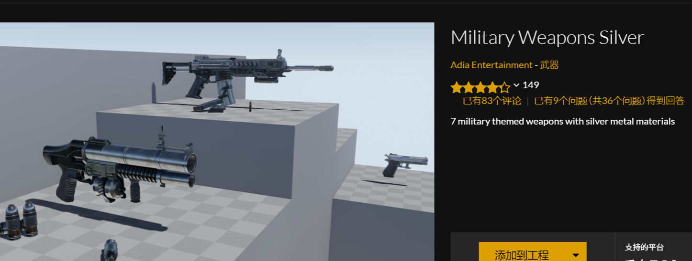
提供武器模型、武器音效、武器特效等等

2. Unreal Learning Kit: Games/虚幻学习工具包

需要使用其中的动画、骨骼

3. Animation Starter Pack/动画初学者内容包

提供一些射击动画，但是确实站立和蹲下的动画，需要去mixamo获取资源


<span id = "3.3">

**3.3 动画及重定向 Retargeting Animations**


动画依附于骨骼，人物模型的骨骼链不同，想要获取不同的动画并应用在我们想要的模型上，需要将目标模型和源模型之间骨骼链对应上，若骨骼链不同，就需要IK Rig分别对骨骼绑定相同的骨骼链，然后使用IK Retargeter

1. mixamo下载动画  
https://blog.csdn.net/m0_55220082/article/details/136478445


2. 动画重定向
使用IK Rig对两个骨骼重定向链条(记得设置重定向根在 “SK_Mannequin” 和 “MixamoCharacter” 的 “骨盆” 处)

使用IK Retargeter，将源和目标资产的姿势调整到一样，导出动画
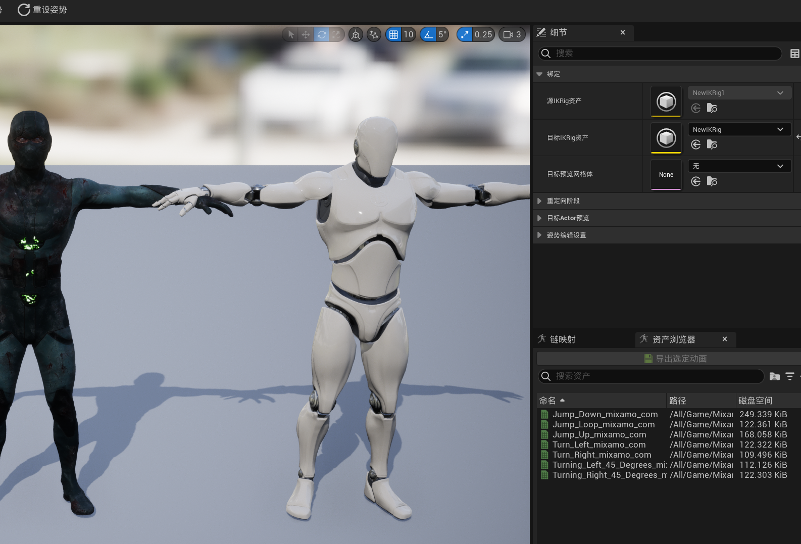
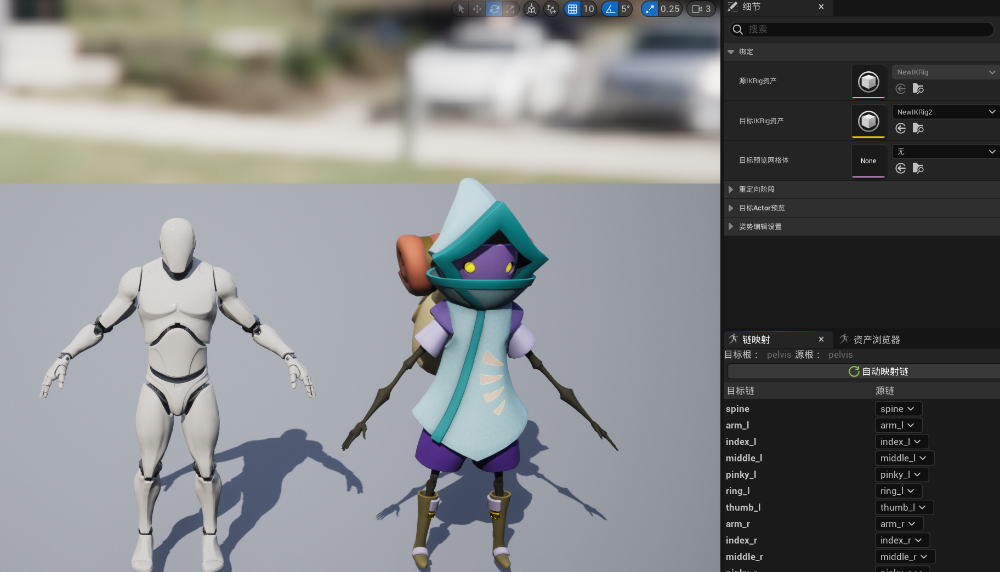


3. 资产迁移

可以将动画的后缀名 “_Retargeted”删去
将资产都迁移到Blaster的content目录下，重复的就覆盖掉，迁移好后，再在Blaster中整理


<span id = "3.4">

**3.4 角色创建**

1. 创建角色c++类
选择Character
删去添加头文件的代码行 “#include "Character/BlasterCharacter.h"” 中的 “Character\”


2. 创建蓝图类

创建基于 “BlasterCharacter” 的 “蓝图”（BluePrint）类 “BP_BlasterCharacter”，保存在目录 “/Content/Blueprints/Character/”

将网格体设置成我们的模型

调整网格体位置，使得 “胶囊体组件 (CollisionCylinder)” 能完全包裹 “网格体 (CharacterMesh0) (骨骼网格体组件)”


<span id = "3.5">

**3.5 摄像机和弹簧臂 Camera and Spring Arm**

将蓝图类拖入关卡，在右侧细节面板中将 “Pawn” 选项卡下的 “自动控制玩家”（Auto possess player）改为 “玩家 0”（Player 0），此时开始可以看到摄像机位于 “BP_BlasterCharacter” 的内部。
摄像头组件Camera和弹簧臂组件Spring Arm可以控制我们拥有角色时的视图


<details><summary>BlasterCharacter.h</summary>

```cpp
private:
	UPROPERTY(VisibleAnywhere, Category = Camera)	
	class USpringArmComponent* CameraBoom;

	UPROPERTY(VisibleAnyWhere, Category = Camera)
	class UCameraComponent* FollowCamera;
```
</details>


<details><summary>BlasterCharacter.cpp</summary>

```cpp
ABlasterCharacter::ABlasterCharacter()
{
 	// Set this character to call Tick() every frame.  You can turn this off to improve performance if you don't need it.
	PrimaryActorTick.bCanEverTick = true;

	CameraBoom = CreateDefaultSubobject<USpringArmComponent>(TEXT("CameraBoom"));	// 基于弹簧臂组件类创建对象
	CameraBoom->SetupAttachment(GetMesh());											// 设置弹簧臂附加到角色的骨骼网格体组件，如果附加到胶囊体上，角色在做蹲下的动作时，由于胶囊体的大小和路线会发生改变，弹簧臂的高度也会发生改变（弹簧臂将会移动）
	CameraBoom->TargetArmLength = 600.f;											// 设置弹簧臂长度
	CameraBoom->bUsePawnControlRotation = true;										// 设置弹簧臂跟随角色控制器旋转

	// 创建摄像机对象 FollowCamera 并设置 FollowCamera 的默认属性
	FollowCamera = CreateDefaultSubobject<UCameraComponent>(TEXT("FollowCamera"));	// 基于摄像机组件类创建对象
	FollowCamera->SetupAttachment(CameraBoom, USpringArmComponent::SocketName);		// 将摄像机附加到弹簧臂 CameraBoom 上，并指定插槽名为虚幻引擎摄像机组件成员变量 SocketName
	FollowCamera->bUsePawnControlRotation = false;

}
```
</details>

角色拥有了摄像机和弹簧臂，是的我们可以有一个第三人称视角


<span id = "3.6">

**3.6 人物移动**

键盘映射
人物移动函数

1. 设置键盘映射


1. 代码
<details><summary>BlasterCharacter.h</summary>

```cpp
protected:
    void MoveForward(float Value);
    void MoveRight(float Value);
    void Turn(float Value);
    void LookUp(float Value);
```
</details>


<details><summary>BlasterCharacter.cpp</summary>

```cpp
void ABlasterCharacter::MoveForward(float Value)
{
	if (Controller != nullptr && Value != 0) {
		//const FVector Direction = GetActorForwardVector()  此函数返回角色向前向量，而我们需要改变我们控制器的前进
		const FRotator YawRotation(0.f, Controller->GetControlRotation().Yaw, 0.f);
		const FVector Direction(FRotationMatrix(YawRotation).GetUnitAxis(EAxis::X));
		//得到一个平行于地面的向量，指向偏航的方向
		//const FVector Direction(FRotationMatrix(0.f, Controller->GetContrlRotation().Yaw, 0.f).GetUnitAxis(EAxis::X));
		AddMovementInput(Direction, Value);
	}
}

void ABlasterCharacter::MoveRight(float Value)
{
	//const FVector Direction = GetActorForwardVector()  此函数返回角色向前向量，而我们需要改变我们控制器的前进
	const FRotator YawRotation(0.f, Controller->GetControlRotation().Yaw, 0.f);
	const FVector Direction(FRotationMatrix(YawRotation).GetUnitAxis(EAxis::Y));
	//const FVector Direction(FRotationMatrix(0.f, Controller->GetContrlRotation().Yaw, 0.f).GetUnitAxis(EAxis::X));
	AddMovementInput(Direction, Value);
}

void ABlasterCharacter::Turn(float Value)
{
	AddControllerYawInput(Value);
}

void ABlasterCharacter::LookUp(float Value)
{
	AddControllerPitchInput(Value);
}

void ABlasterCharacter::SetupPlayerInputComponent(UInputComponent* PlayerInputComponent)
{
	Super::SetupPlayerInputComponent(PlayerInputComponent);

	PlayerInputComponent->BindAction("Jump", IE_Pressed, this, &ACharacter::Jump);

	PlayerInputComponent->BindAxis("MoveForward", this, &ABlasterCharacter::MoveForward);
	PlayerInputComponent->BindAxis("MoveRight", this, &ABlasterCharacter::MoveRight);
	PlayerInputComponent->BindAxis("Turn", this, &ABlasterCharacter::Turn);
	PlayerInputComponent->BindAxis("LookUp", this, &ABlasterCharacter::LookUp);

}
```
</details>

3. 细节知识

* 欧拉角
roll---pitch---yaw
分别绕x y z旋转角度
翻滚 俯仰 偏航
代表了绕轴旋转的角度
参考：[欧拉角](https://blog.csdn.net/daidi1989/article/details/95167676)

* GetActorForwardVector()
该函数得到 character 的前进方向，也就是根节点 capsule 的 forward vector
但是我们要改变controller的方向，root component和controller的方向可能不一样

* AddMovementInput()
这个函数会根据第一个参数的值去移动角色，第二个参数val是个浮点数
val就是键盘映射那里的scale的值

* FRotator
Yaw 表示 摇头 就是绕 Z 移动；
Pich 表示 点头 就是绕 Y 移动；
Roll 你可以想象成左右晃脑，绕 X轴运动。
这三个变量组成了 UE4 里面所有物体的旋转方向，它是一个结构体叫 FRotator。


<span id = "3.7">

**3.7 动画蓝图**

本节为角色的移动创建动画，需要Animinstance类

1. 创建Animinstance类及蓝图类

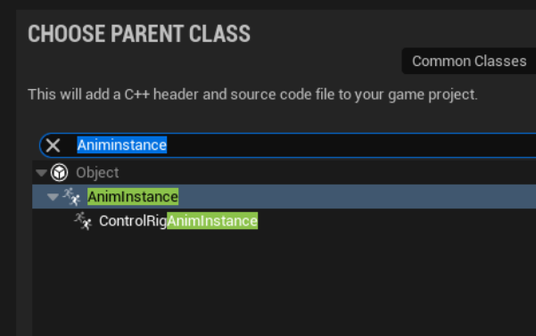

<details><summary>BlasterAnimInstance.h</summary>

```cpp
public:
	virtual void NativeInitializeAnimation() override;
	virtual void NativeUpdateAnimation(float DeltaTime) override;

private:
	UPROPERTY(BlueprintReadOnly, Category = Character, meta = (AllowPrivateAccess = "true"))	// 属性说明符：仅在蓝图中可读，类别为 “Character”；
	class ABlasterCharacter* BlasterCharacter;

	UPROPERTY(BlueprintReadOnly, Category = Movement, meta = (AllowPrivateAccess = "true"))
	float Speed;

	UPROPERTY(BlueprintReadOnly, Category = Movement, meta = (AllowPrivateAccess = "true"))
	bool bIsInAir;

	UPROPERTY(BlueprintReadOnly, Category = Movement, meta = (AllowPrivateAccess = "true"))
	bool bIsAccelerating;
```
</details>


<details><summary>BlasterAnimInstance.cpp</summary>

```cpp
void UBlasterAnimInstance::NativeInitializeAnimation()					// 原生（Native）类初始化函数 NativeInitializeAnimation() 重写
{
	Super::NativeInitializeAnimation();									// 调用父类 AnimInstance 的 NativeInitializeAnimation() 函数

	// https://blog.csdn.net/ttm2d/article/details/106550682
	BlasterCharacter = Cast<ABlasterCharacter>(TryGetPawnOwner());		// 获取动画蓝图实例所属，并向下强制转换（Cast）为 ABlasterCharacter 类

}

void UBlasterAnimInstance::NativeUpdateAnimation(float DeltaTime)		// 原生（Native）类更新函数 NativeUpdateAnimation() 重写，用于在每一帧调用以更新动画
{
	Super::NativeUpdateAnimation(DeltaTime);							// 调用父类 AnimInstance 的 NativeUpdateAnimation() 函数

	if (BlasterCharacter == nullptr) {									// 检查 BlasterCharacter 是否声明
		BlasterCharacter = Cast<ABlasterCharacter>(TryGetPawnOwner());	// 获取动画蓝图实例所属，并向下强制转换（Cast）为 ABlasterCharacter 类
	}
	if (BlasterCharacter == nullptr) return;


	FVector Velocity = BlasterCharacter->GetVelocity();					// 获取角色速度向量
	Velocity.Z = 0.f;													// 不关心 Z 轴速度，设置为 0
	Speed = Velocity.Size();											// 获取角色速度向量的模（大小）

	bIsInAir = BlasterCharacter->GetCharacterMovement()->IsFalling();	// 调用 GetCharacterMovement()->IsFalling() 函数判断角色是否掉落从而判断角色是否在空中，
	// 需要添加头文件 "GameFramework/CharacterMovementComponent.h"

	bIsAccelerating = BlasterCharacter->GetCharacterMovement()->GetCurrentAcceleration().Size() > 0 ? true : false;	// 调用 GetCharacterMovement()->GetCurrentAcceleration() 获取角色加速度
	// 判断加速度是否的维度是否大于 0 ，大于 0 说明某个方向上有加速度
}
```
</details>


编译后创建蓝图类，选择骨骼和父类

2. 在蓝图类创建状态机

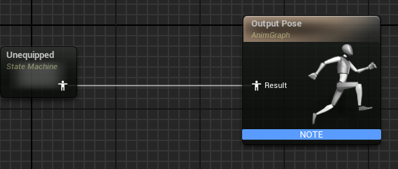

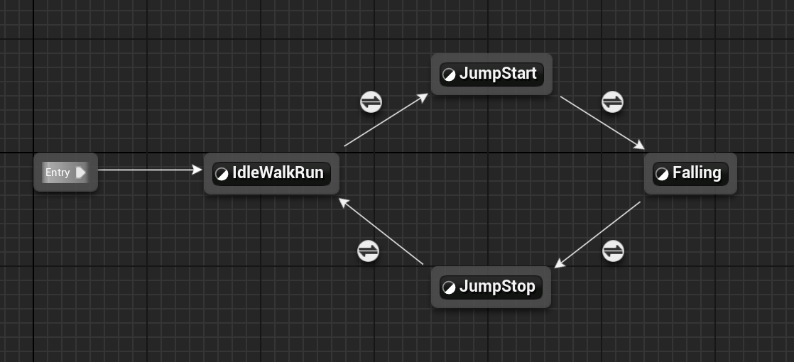

IdleWalkRun to JumpStart
若是在空，则表示起跳了
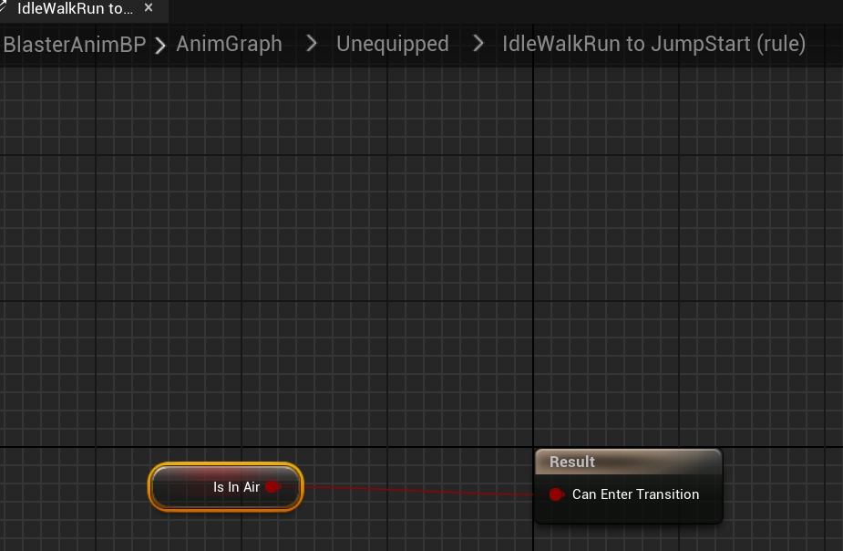

对于 “JumpStart to Falling” 状态转换，在右侧 “细节”（Details） 面板启用 “基于状态中的序列播放器的自动规则”（Automatic Rule Based on Sequence Player in State）选项，这样在状态 “JumpStart” 动画播放完毕状态结束后会自动过渡到状态 “Falling”。
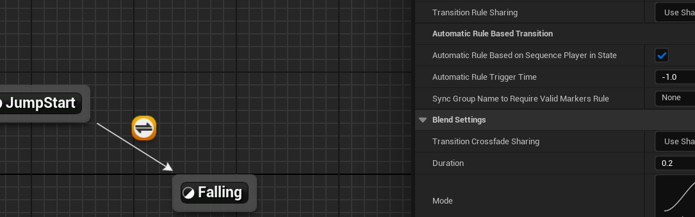

对于 “Falling to JumpStop” 的状态转换，加一个NOT Boolean 节点
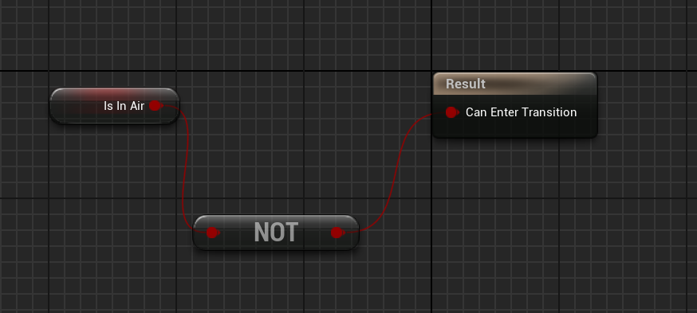

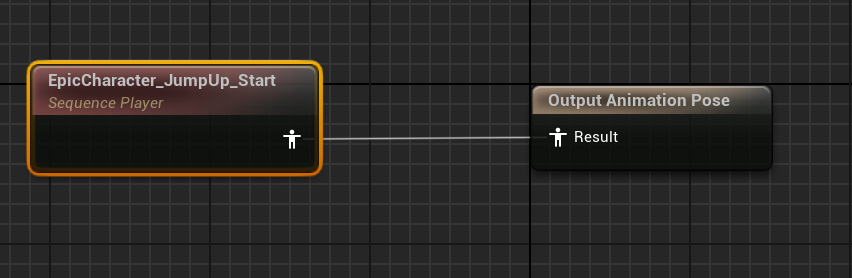

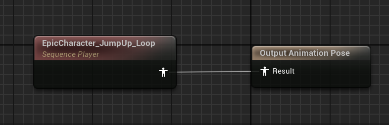

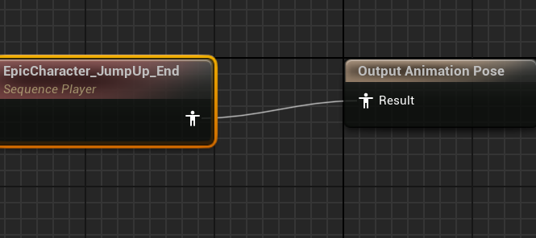

JumpStop to ldleWalkRun
当动画剩余不超过10%时转换
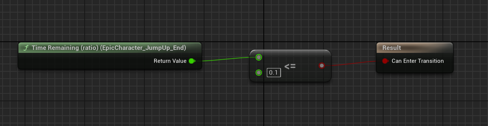


3. 一维混合空间

对于角色水平状态移动的状态机 “IdleWalkRun” 节点，我们需要创建混合空间（Blend Space），从而实现人物由怠速至行走至跑步的自然过渡。

创建blend space 1D

在右侧 “资产浏览器”（Asset Browser）中将动画 “EpicCharacter_Idle” 、“EpicCharacter_Walk” 和 “EpicCharacter_Run” 拖拽至编辑器下方 “动画序列” 面板中。
在左侧 “资产细节”（Asset Details）面板设置 “水平坐标”（Horizontal Axis） 的“名称”（Name）为 “Speed”，“最大轴值”（Maximum Axis Value）为 350，并在 “动画序列” 面板中对 “EpicCharacter_Walk” 和 “EpicCharacter_Run” 进行拖拽、调整。
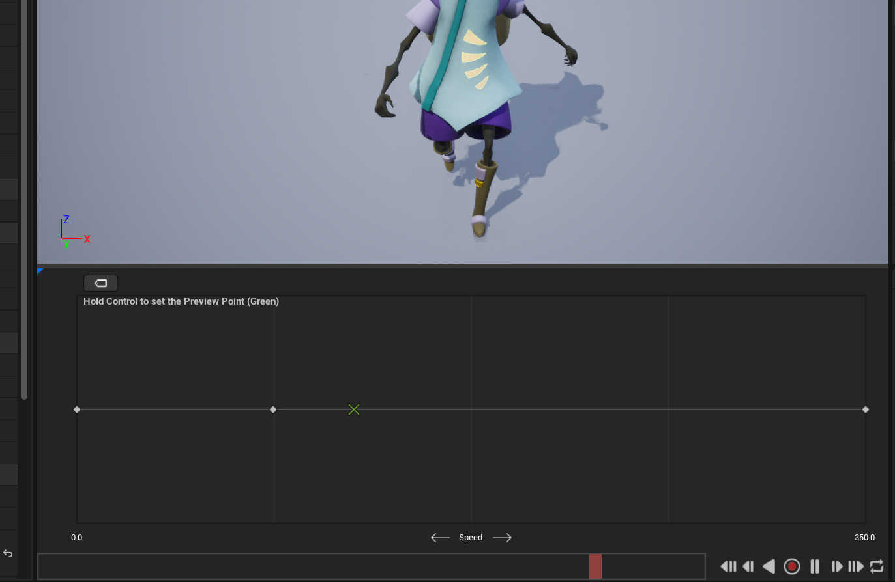


IdleWalkRun
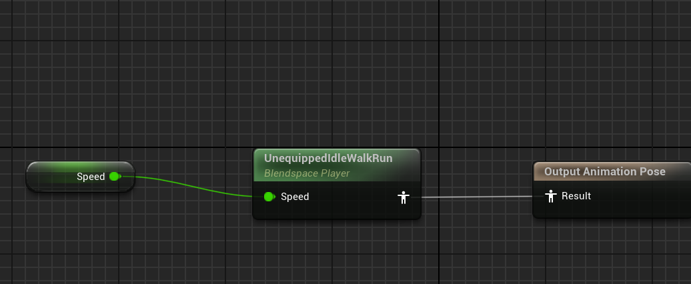

修改角色蓝图类的动画模式
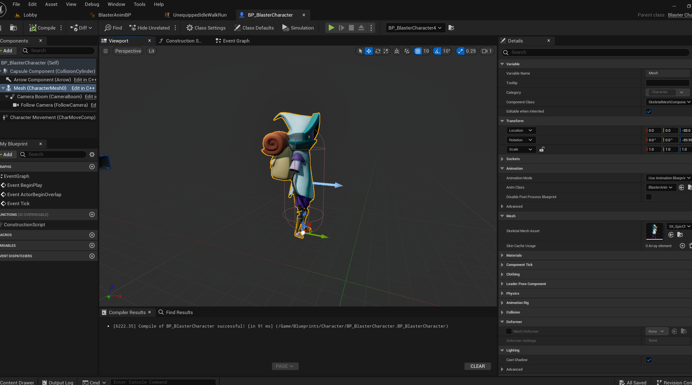


为了让移动更合理,添加两行代码，并在蓝图中进行相应设置

```cpp
	bUseControllerRotationYaw = false;												// 设置人物不跟随控制器（镜头）转向，也可以在 BP_BlasterCharacter 蓝图编辑器中实现
	GetCharacterMovement()->bOrientRotationToMovement = true;						// 获取角色移动组件，角色移动时向加速度方向旋转角色，也可以在 BP_BlasterCharacter 蓝图编辑器中实现
```

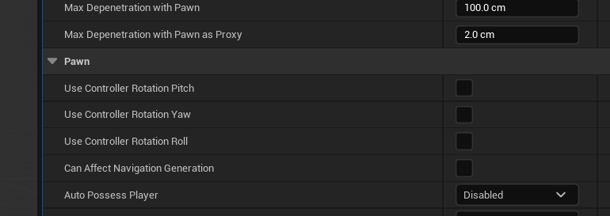
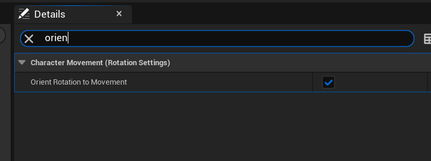

* 关于人物转向问题
https://blog.csdn.net/u012249992/article/details/83186907
https://www.bilibili.com/read/cv19334054/


<span id = "3.8">

**3.8 无缝传送 Seamless travel and lobby**

seamless travel

* seamless travel
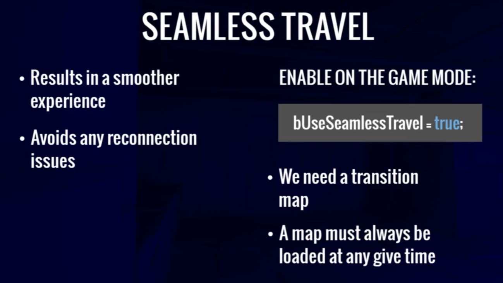

* nonseamless travel
指断开连接再重新连接
第一次加载地图
第一次加载服务器
结束多人游戏并开始新游戏
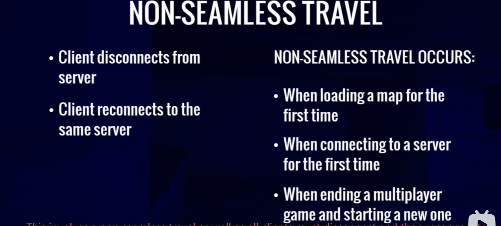


SeverTravel
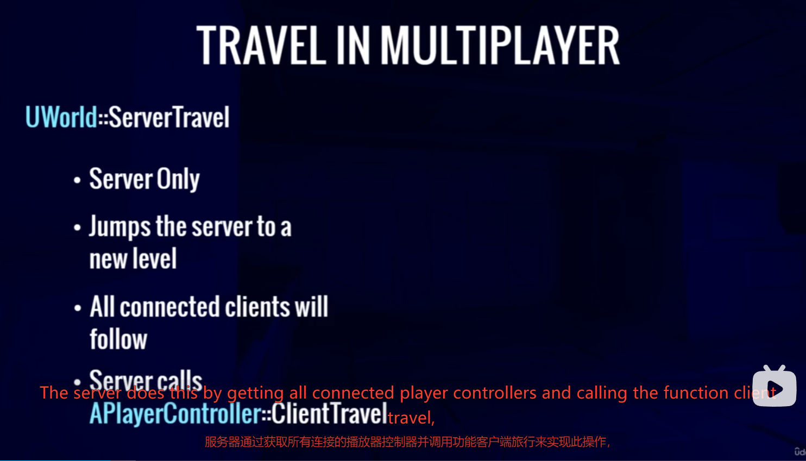
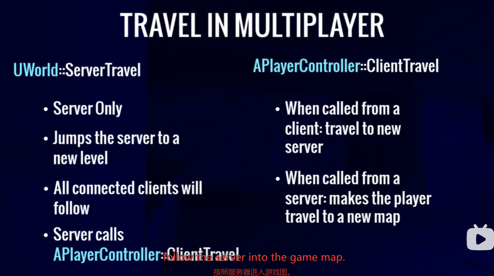


transition level

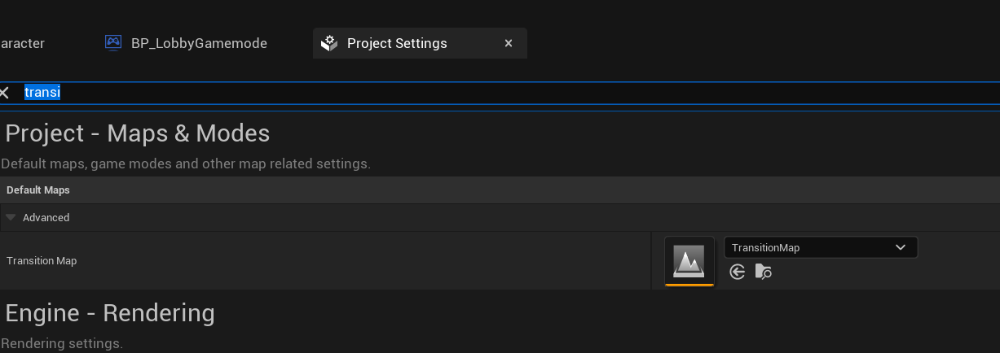


lobby game mode

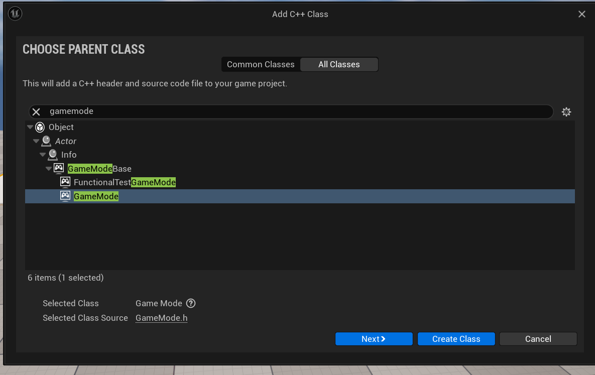

该类记录lobby人数


将学习包的showcase level复制到我们的maps文件夹，当人数满了我们传送到该关卡

创建一个lobby game mode蓝图类，

将default pawn class设置成我们的角色蓝图类
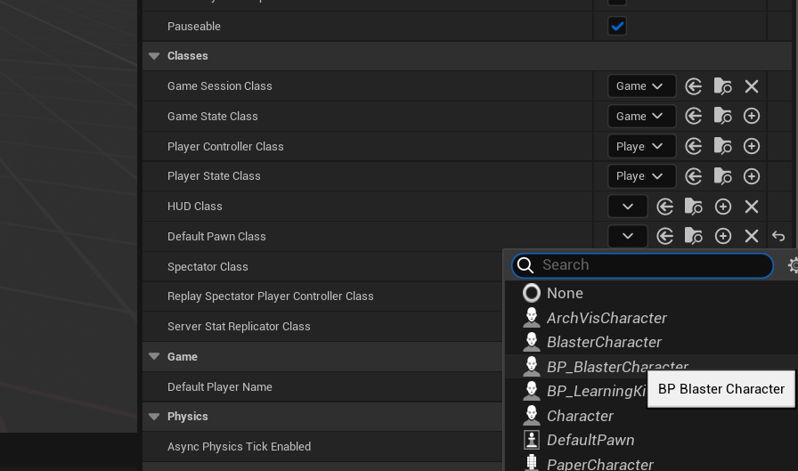

修改lobby level
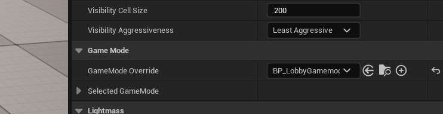

此时删除关卡中的人物，进入关卡会自动生成一个角色


<span id = "3.9">

**3.9 网络规则 Network Role**


---

<span id = "4">

**四、武器**


---

<span id = "5">

**五、射击武器**


---

<span id = "6">

**六、武器瞄准机制**


---

<span id = "7">

**七、健康状况和玩家统计数据**


---

<span id = "8">

**八、弹药**


---

<span id = "9">

**九、匹配状态**


---

<span id = "10">

**十、不同武器类型**


---

<span id = "11">

**十一、拾取**


---

<span id = "12">

**十二、滞后补偿**


---

<span id = "13">

**十三、更多多人游戏类型**


---

<span id = "14">

**十四、队伍**


---

<span id = "15">

**十五、夺旗**


