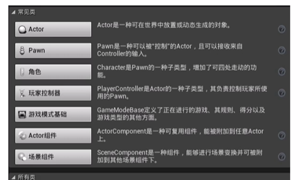

目录  
[一、介绍](#1)  
[二、创建多人游戏插件](#2)  
[三、创建项目](#3)  
&emsp;[3.1 项目创建及准备工作](#3.1)  
&emsp;[3.2 资产 Assets](#3.2)  
&emsp;[3.3 动画及重定向 Retargeting Animations](#3.3)  
&emsp;[3.4 游戏创建](#3.4)  
&emsp;[3.5 摄像机和弹簧臂 Camera and Spring Arm](#3.5)  
&emsp;[3.6 人物移动](#3.6)  
&emsp;[3.7 动画蓝图](#3.7)  
&emsp;[3.8 无缝传送 Seamless travel and lobby](#3.8)  
&emsp;[3.9 网络规则 Network Role](#3.9)  
[四、武器](#4)  
&emsp;[4.1 武器类](#4.1)  
&emsp;[4.2 捡子弹 Pickup Widget](#4.2)  
&emsp;[4.3 变量复制 Variable Replication](#4.3)  
&emsp;[4.4 装备武器 Equipping Weapons](#4.4)  
&emsp;[4.5 远程过程调用 Remote Procedure Calls](#4.5)  
&emsp;[4.6 装备动画姿势 Equipped Animation Pose](#4.6)  
&emsp;[4.7 蹲下 Crouching](#4.7)  
&emsp;[4.8 瞄准 Aiming](#4.8)  
&emsp;[4.9 跑步混合空间 Running Blendspace](#4.9)  
&emsp;[4.10 倾斜和扫射 Leaning and Strafing](#4.10)  
&emsp;[4.11 走路和跳跃 Idle and Jumps](#4.11)  
&emsp;[4.12 蹲走 Crouch Walking](#4.12)  
&emsp;[4.13 瞄准走 Aim Walking](#4.13)  
&emsp;[4.14 瞄准偏移 Aim Offsets](#4.14)  
&emsp;[4.15 瞄准偏移应用](#4.15)  
&emsp;[4.16 多人匹配 Pitch in Multiplayer](#4.16)  
&emsp;[4.17 使用瞄准偏移](#4.17)  
&emsp;[4.18 FABRIK IK](#4.18)  
&emsp;[4.19 原地转弯 Turning in place](#4.19)  
&emsp;[4.20 旋转根骨骼 Rotate Root Bone](#4.20)  
&emsp;[4.21 网络更新频率](#4.21)  
&emsp;[4.22 未装备时蹲着](#4.22)  
&emsp;[4.23 跑步转弯动画 Rotating Running Animations](#4.23)  
&emsp;[4.24 脚步声和跳跃声 Footstep and Jump Sounds](#4.24)  
&emsp;[4.25 瞄准走](#4.25)  
[五、射击武器](#5)  
&emsp;[5.1 炮弹武器 Projectile Weapon Class](#5.1)  
&emsp;[5.2 火蒙太奇 Fire Montage](#5.2)  
&emsp;[5.3 火武器效果](#5.3)  
&emsp;[5.4 多人游戏中的火效果 Fire Effects in Multiplayer](#5.4)  
&emsp;[5.5 击中目标 The Hit Target](#5.5)  
&emsp;[5.6 生成炮弹 Spawning the Projectile](#5.6)  
&emsp;[5.7 炮弹移动组件](#5.7)  
&emsp;[5.8 炮弹追踪 Projectile Tracer](#5.8)  
&emsp;[5.9 重复击中目标](#5.9)  
&emsp;[5.10 炮弹命中事件](#5.10)  
&emsp;[5.11 弹壳](#5.11)  
&emsp;[5.12 弹壳的物理性质](#5.12)  
[六、武器瞄准机制](#6)  
&emsp;[6.1 游戏HUD和玩家控制器 Blaster HUD and Player Controller](#6.1)  
&emsp;[6.1 绘制准星 Drawing the Crosshairs](#6.1)  
&emsp;[6.1 武器旋转矫正 Correcting the Weapon Rotation](#6.1)  
&emsp;[6.1 瞄准缩放 Zoom While Aiming](#6.1)  
&emsp;[6.1 准星缩放 Shrink Crosshairs when Aiming](#6.1)  
&emsp;[6.1 改变准星颜色](#6.1)  
&emsp;[6.1 扩展跟踪开始 Extending the Trace Start](#6.1)  
&emsp;[6.1 命中角色](#6.1)  
&emsp;[6.1 平滑代理角色的旋转 Smooth Rotation for Proxies](#6.1)  
&emsp;[6.1 自动开火 Automatic Fire](#6.1)  
&emsp;[6.1 测试](#6.1)  
[七、健康状况和玩家统计数据](#7)  
&emsp;[7.1 游戏框架 Game Framework](#7.1)  
&emsp;[7.1 血量 Health](#7.1)  
&emsp;[7.1 更新血量 Update Health in the HUD](#7.1)  
&emsp;[7.1 伤害 Demage](#7.1)  
&emsp;[7.1 游戏模式 Blaster Game Mode](#7.1)  
&emsp;[7.1 消除动画 Elim Animation](#7.1)  
&emsp;[7.1 重生 Respawning](#7.1)  
&emsp;[7.1 物质溶解 Dissolve Material](#7.1)  
&emsp;[7.1 溶解角色](#7.1)  
&emsp;[7.1 溶解曲线 Dissolving with Curves](#7.1)  
&emsp;[7.1 被消除时禁止移动 Disable Movement when Elimmed](#7.1)  
&emsp;[7.1 消除机器人](#7.1)  
&emsp;[7.1 拥有状态 On Possess](#7.1)  
&emsp;[7.1 角色状态 Blaster Player State](#7.1)  
&emsp;[7.1 战败 Defeats](#7.1)  
[八、弹药](#8)  
&emsp;[8.1 武器弹药](#8.1)  
&emsp;[8.1 可以开火](#8.1)  
&emsp;[8.1 携带子弹](#8.1)  
&emsp;[8.1 显示携带子弹](#8.1)  
&emsp;[8.1 换子弹 Reloading](#8.1)  
&emsp;[8.1 重载战斗状态](#8.1)  
&emsp;[8.1 允许武器开火](#8.1)  
&emsp;[8.1 更新子弹](#8.1)  
&emsp;[8.1 换弹效果 Reload Effects](#8.1)  
&emsp;[8.1 自动装填](#8.1)  
[九、匹配状态](#9)  
&emsp;[9.1 游戏时间](#9.1)  
&emsp;[9.1 同步客户端和服务器时间 Syncing Client and Server Time](#9.1)  
&emsp;[9.1 匹配状态](#9.1)  
&emsp;[9.1 正在匹配状态设置](#9.1)  
&emsp;[9.1 预热时间 Warmup Timer](#9.1)  
&emsp;[9.1 预热时间更新](#9.1)  
&emsp;[9.1 自定义匹配状态 Custom Match States](#9.1)  
&emsp;[9.1 冷却时间公告 Cooldown Announcement](#9.1)  
&emsp;[9.1 重启游戏](#9.1)  
&emsp;[9.1 游戏状态 Blaster Game State](#9.1)  
[十、不同武器类型](#10)  
&emsp;[10.1 火箭弹 Rocket Projectile](#10.1)  
&emsp;[10.2 火箭轨迹 Rocket Trails](#10.1)  
&emsp;[10.3 生成火箭轨迹 Rocket Trails](#10.1)  
&emsp;[10.4 火箭移动组件](#10.1)  
&emsp;[10.5 命中扫描武器 Hit Scan Weapons](#10.1)  
&emsp;[10.6 激光 Beam Particles](#10.1)  
&emsp;[10.7 冲锋枪 Submachine Gun](#10.1)  
&emsp;[10.8 Strap Physics](#10.1)  
&emsp;[10.9 霰弹枪 Shotgun](#10.1)  
&emsp;[10.10 武器散布 Weapon Scatter](#10.1)  
&emsp;[10.11 狙击步枪 Sniper Rifle](#10.1)  
&emsp;[10.12 狙击镜 Sniper Scope](#10.1)  
&emsp;[10.13 手榴弹发射器 Grenade Launcher](#10.1)  
&emsp;[10.14 榴弹 Projectile Grenades](#10.1)  
&emsp;[10.15 装填动画](#10.1)  
&emsp;[10.16 霰弹枪装填](#10.1)  
&emsp;[10.17 weapon outline effects](#10.1)  
&emsp;[10.18 扔手榴弹蒙太奇 Grenade Throw Montage](#10.1)  
&emsp;[10.19 扔手榴弹时的武器附着](#10.1)  
&emsp;[10.20 榴弹资产](#10.1)  
&emsp;[10.21 展示](#10.1)  
&emsp;[10.22 生成手榴弹](#10.1)  
&emsp;[10.23 多人游戏中的手榴弹](#10.1)  
&emsp;[10.24 HUD中的手榴弹](#10.1)  
[十一、拾取](#11)  
&emsp;[11.1 拾取类](#11.1)  
&emsp;[11.1 拾取子弹](#11.1)  
&emsp;[11.1 buff组件](#11.1)  
&emsp;[11.1 血量拾取](#11.1)  
&emsp;[11.1 治疗角色](#11.1)  
&emsp;[11.1 速度buff](#11.1)  
&emsp;[11.1 跳跃buff](#11.1)  
&emsp;[11.1 护盾 Shield Bar](#11.1)  
&emsp;[11.1 护盾更新](#11.1)  
&emsp;[11.1 拾取出生点](#11.1)  
&emsp;[11.1 添加出生点](#11.1)  
&emsp;[11.1 出生时的默认武器](#11.1)  
&emsp;[11.1 副武器](#11.1)  
&emsp;[11.1 更换武器](#11.1)  
&emsp;[11.1 丢掉副武器](#11.1)  
[十二、滞后补偿](#12)  
&emsp;[12.1 滞后补偿概念 Lag Compensation Concepts](#12.1)  
&emsp;[12.1 高延迟警告](#12.1)  
&emsp;[12.1 本地开火效果 Local Fire Effects](#12.1)  
&emsp;[12.1 滞后补偿概念](#12.1)  
&emsp;[12.1 滞后补偿概念](#12.1)  
&emsp;[12.1 滞后补偿概念](#12.1)  
&emsp;[12.1 滞后补偿概念](#12.1)  
&emsp;[12.1 滞后补偿概念](#12.1)  
&emsp;[12.1 滞后补偿概念](#12.1)  
&emsp;[12.1 滞后补偿概念](#12.1)  
&emsp;[12.1 滞后补偿概念](#12.1)  
&emsp;[12.1 滞后补偿概念](#12.1)  
&emsp;[12.1 滞后补偿概念](#12.1)  
&emsp;[12.1 滞后补偿概念](#12.1)  
&emsp;[12.1 滞后补偿概念](#12.1)  
&emsp;[12.1 滞后补偿概念](#12.1)  
&emsp;[12.1 滞后补偿概念](#12.1)  
&emsp;[12.1 滞后补偿概念](#12.1)  
&emsp;[12.1 滞后补偿概念](#12.1)  
&emsp;[12.1 滞后补偿概念](#12.1)  
&emsp;[12.1 滞后补偿概念](#12.1)  
&emsp;[12.1 滞后补偿概念](#12.1)  
&emsp;[12.1 滞后补偿概念](#12.1)  
&emsp;[12.1 滞后补偿概念](#12.1)  
&emsp;[12.1 滞后补偿概念](#12.1)  
&emsp;[12.1 滞后补偿概念](#12.1)  
&emsp;[12.1 滞后补偿概念](#12.1)  
&emsp;[12.1 滞后补偿概念](#12.1)  
&emsp;[12.1 滞后补偿概念](#12.1)  
&emsp;[12.1 滞后补偿概念](#12.1)  
&emsp;[12.1 滞后补偿概念](#12.1)  
&emsp;[12.1 滞后补偿概念](#12.1)  
&emsp;[12.1 滞后补偿概念](#12.1)  
&emsp;[12.1 滞后补偿概念](#12.1)  
&emsp;[12.1 滞后补偿概念](#12.1)  
&emsp;[12.1 滞后补偿概念](#12.1)  
&emsp;[12.1 滞后补偿概念](#12.1)  
&emsp;[12.1 滞后补偿概念](#12.1)  
&emsp;[12.1 滞后补偿概念](#12.1)  
&emsp;[12.1 滞后补偿概念](#12.1)  

[十三、更多多人游戏类型](#13)  
[十四、队伍](#14)  
[十五、夺旗](#15)  


**目前遇到的问题**

1. 3.7人物移动
root component和controller的方向可能不一样
具体有什么区别？
代码中，将yaw经过什么样的转换得到Direction？
得到的Direction是什么样的？
GetUnitAxis(EAxis::X)中XY的区别？


**UE知识**

1. 常见类
2. 
Object-Actor 


---

<span id = "1">

**一、介绍**

123123123


---

<span id = "2">

**二、创建多人游戏插件**


---

<span id = "3">

**三、创建项目**


<span id = "3.6">

**3.6 人物移动**

键盘映射
人物移动函数

1. 设置键盘映射


1. 代码
<details><summary>BlasterCharacter.h</summary>

```cpp
protected:
    void MoveForward(float Value);
    void MoveRight(float Value);
    void Turn(float Value);
    void LookUp(float Value);
```
</details>


<details><summary>BlasterCharacter.cpp</summary>

```cpp
void ABlasterCharacter::MoveForward(float Value)
{
	if (Controller != nullptr && Value != 0) {
		//const FVector Direction = GetActorForwardVector()  此函数返回角色向前向量，而我们需要改变我们控制器的前进
		const FRotator YawRotation(0.f, Controller->GetControlRotation().Yaw, 0.f);
		const FVector Direction(FRotationMatrix(YawRotation).GetUnitAxis(EAxis::X));
		//得到一个平行于地面的向量，指向偏航的方向
		//const FVector Direction(FRotationMatrix(0.f, Controller->GetContrlRotation().Yaw, 0.f).GetUnitAxis(EAxis::X));
		AddMovementInput(Direction, Value);
	}
}

void ABlasterCharacter::MoveRight(float Value)
{
	//const FVector Direction = GetActorForwardVector()  此函数返回角色向前向量，而我们需要改变我们控制器的前进
	const FRotator YawRotation(0.f, Controller->GetControlRotation().Yaw, 0.f);
	const FVector Direction(FRotationMatrix(YawRotation).GetUnitAxis(EAxis::Y));
	//const FVector Direction(FRotationMatrix(0.f, Controller->GetContrlRotation().Yaw, 0.f).GetUnitAxis(EAxis::X));
	AddMovementInput(Direction, Value);
}

void ABlasterCharacter::Turn(float Value)
{
	AddControllerYawInput(Value);
}

void ABlasterCharacter::LookUp(float Value)
{
	AddControllerPitchInput(Value);
}

void ABlasterCharacter::SetupPlayerInputComponent(UInputComponent* PlayerInputComponent)
{
	Super::SetupPlayerInputComponent(PlayerInputComponent);

	PlayerInputComponent->BindAction("Jump", IE_Pressed, this, &ACharacter::Jump);

	PlayerInputComponent->BindAxis("MoveForward", this, &ABlasterCharacter::MoveForward);
	PlayerInputComponent->BindAxis("MoveRight", this, &ABlasterCharacter::MoveRight);
	PlayerInputComponent->BindAxis("Turn", this, &ABlasterCharacter::Turn);
	PlayerInputComponent->BindAxis("LookUp", this, &ABlasterCharacter::LookUp);

}
```
</details>

3. 细节知识

* 欧拉角
roll---pitch---yaw
分别绕x y z旋转角度
翻滚 俯仰 偏航
代表了绕轴旋转的角度
参考：[欧拉角](https://blog.csdn.net/daidi1989/article/details/95167676)

* GetActorForwardVector()
该函数得到 character 的前进方向，也就是根节点 capsule 的 forward vector
但是我们要改变controller的方向，root component和controller的方向可能不一样

* AddMovementInput()
这个函数会根据第一个参数的值去移动角色，第二个参数val是个浮点数
val就是键盘映射那里的scale的值

* FRotator
Yaw 表示 摇头 就是绕 Z 移动；
Pich 表示 点头 就是绕 Y 移动；
Roll 你可以想象成左右晃脑，绕 X轴运动。
这三个变量组成了 UE4 里面所有物体的旋转方向，它是一个结构体叫 FRotator。


<span id = "3.7">

**3.7 动画蓝图**


---

<span id = "4">

**四、武器**


---

<span id = "5">

**五、射击武器**


---

<span id = "6">

**六、武器瞄准机制**


---

<span id = "7">

**七、健康状况和玩家统计数据**


---

<span id = "8">

**八、弹药**


---

<span id = "9">

**九、匹配状态**


---

<span id = "10">

**十、不同武器类型**


---

<span id = "11">

**十一、拾取**


---

<span id = "12">

**十二、滞后补偿**


---

<span id = "13">

**十三、更多多人游戏类型**


---

<span id = "14">

**十四、队伍**


---

<span id = "15">

**十五、夺旗**


